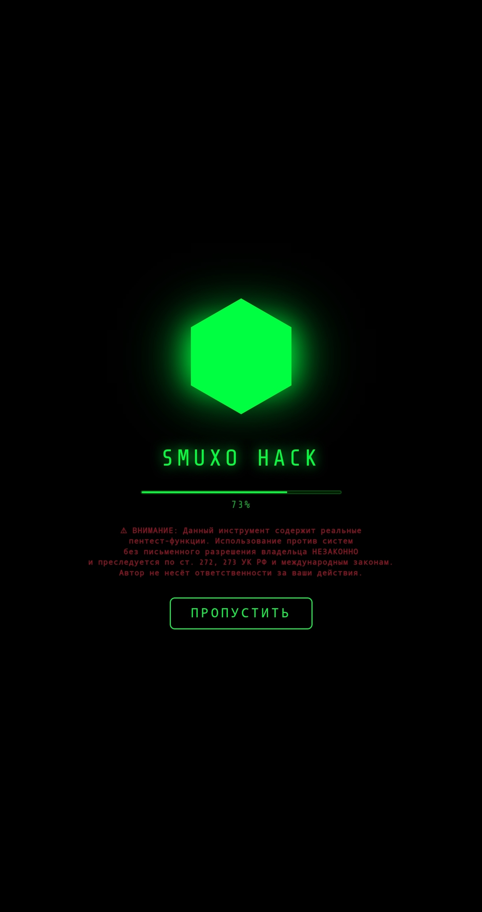
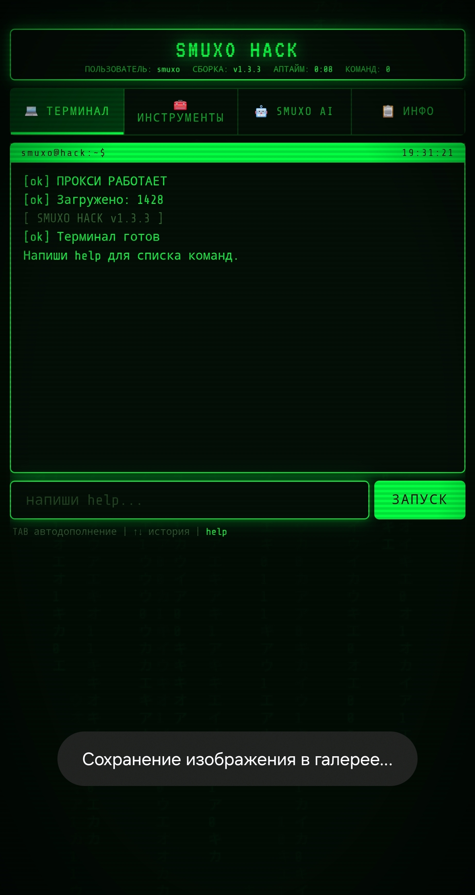
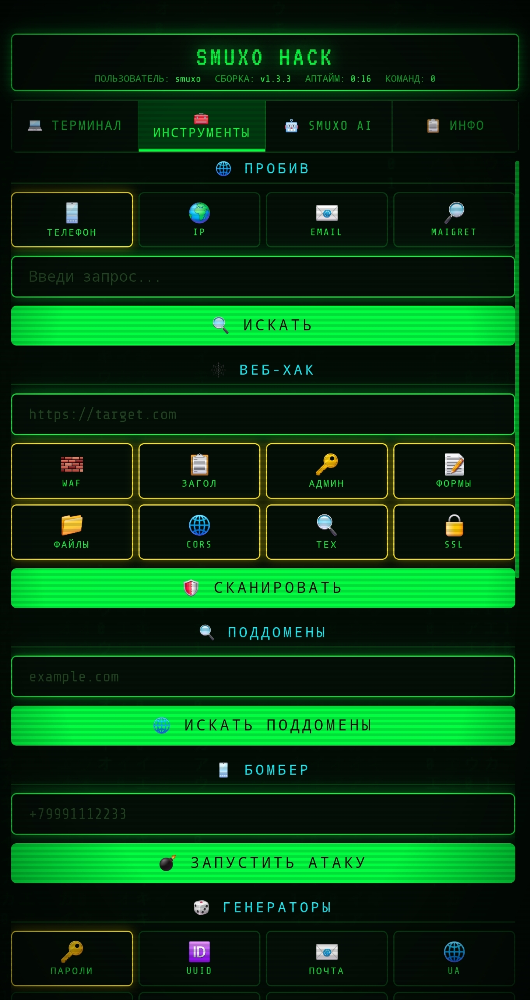
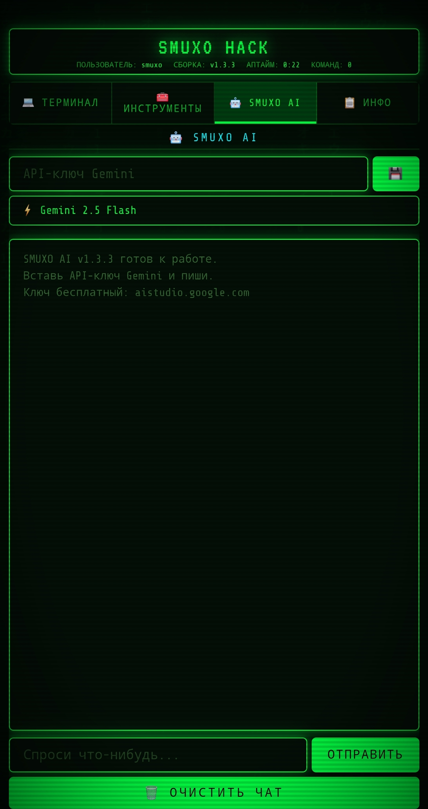

# smuxo HACK v1.3.3

Портативный хакерский мультитул в одном HTML-файле (PWA). Работает полностью в браузере, без сервера.

## Возможности

### 💻 Терминал
- Командная строка с автодополнением (TAB) и историей (↑↓)
- Алиасы (`alias`), повтор команд (`repeat`)
- Экспорт сессии в TXT/CSV/JSON
- Встроенные команды: `help`, `clear`, `history`, `whois`, `dns`, `hash`, `encode`, `decode`

### 🌐 ПРОБИВ
- **📱 Телефон**
- **🌍 IP**
- **📧 Email** (проверка утечек)
- **🔎 Maigret** — поиск по 1400+ сайтам (кешируется)

### 🕸️ ВЕБ-ХАК
- 🧱 Обнаружение WAF (Cloudflare, Sucuri)
- 📋 Анализ заголовков безопасности (CSP, HSTS, X-Frame)
- 🔑 Поиск админ-панелей
- 📝 Поиск форм
- 📁 Поиск файлов (robots.txt, .git, .env)
- 🌐 Проверка CORS
- 🔍 Определение технологий
- 🔒 Проверка SSL

### 🔍 ПОДДОМЕНЫ
- Поиск через crt.sh
- Wayback Machine

### 📱 БОМБЕР
- Telegram OAuth (13 эндпоинтов)
- 20 потоков × 20 циклов
- Только СНГ номера

### 🎲 ГЕНЕРАТОРЫ
- 🔑 Пароли (3 уровня сложности)
- 🆔 UUID
- 📧 Email
- 🌐 User-Agent
- 📍 IP-адреса
- 👤 Личность (ФИО, адрес, паспорт, ИНН, СНИЛС)
- 🔗 Прокси (через API)
- 📋 UA List
- 🏠 Адреса (5 стран)

### 💳 КАРТЫ
- Luhn-генератор
- BIN Lookup
- База проверенных BIN'ов

### 🔄 КОНВЕРТЕРЫ
- Unix Timestamp ↔ Дата
- IP в число
- MAC адрес
- HEX ↔ RGB
- Байты в читаемый вид

### 📦 ОБФУСКАТОР
- Base16/32/64
- ROT13
- XOR
- Hex/Octal/Unicode Escape
- Многослойный (Base16+Zlib+Base64)

### 🤖 DICSTERY AI
- Gemini 2.5 Flash / 2.5 Pro
- Бесплатный API-ключ на aistudio.google.com
- Системный промт Dicstery
- История диалога

## Скриншоты

| Терминал |
|---|
|  |

| Инструменты |
|---|
|  |

| AI |
|---|
|  |

## Технологии

- **PWA** — работает офлайн после загрузки
- **WebLLM** — поддержка локального ИИ через Wllama
- **Gemini API** — облачный ИИ от Google
- **CORS Proxy** — автоматический выбор рабочего прокси
- **IndexedDB** — кеширование Maigret и моделей ИИ

## Системные требования

- **Браузер:** Chrome 90+, Firefox 90+, Safari 15+, Edge 90+
- **Android:** 7.0+ (для APK)
- **Память:** 512 МБ+ ОЗУ для ИИ-моделей

## Дисклеймер

⚠ Данный инструмент создан в образовательных целях. Использование против систем без письменного разрешения владельца незаконно. Автор не несёт ответственности за ваши действия.

## Автор

**smuxo** — кодер, фанат космоса и программирования.

## Лицензия

MIT License — свободное использование и модификация.
